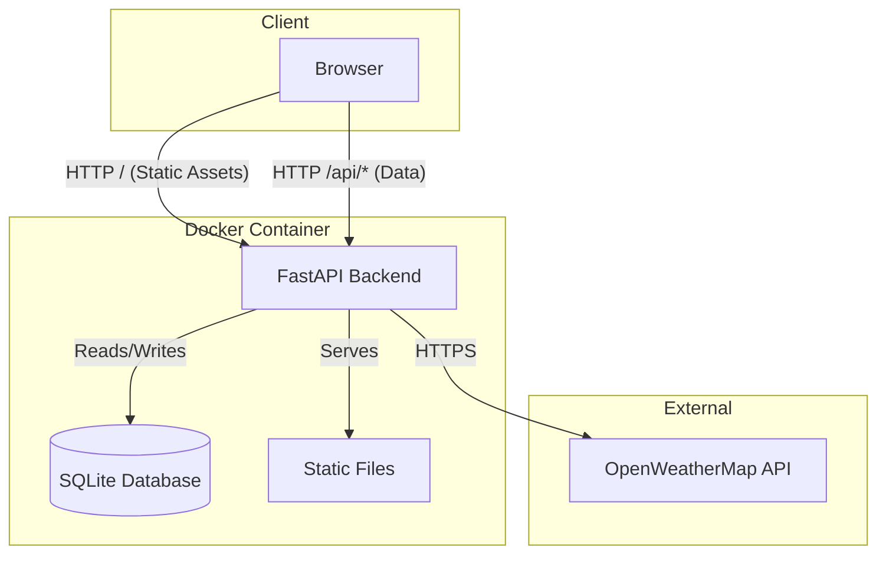

# Project Overview

This project is a web application that displays the current time, a persistent todo list, and weather information. It consists of a static frontend (HTML/CSS/JS) and a Python backend (FastAPI) that manages data persistence and proxies external API calls.

## Key Features

*   **Live Clock:** Displays the current time and date, updated every second.
*   **Todo List:** A persistent todo list stored in a SQLite database via a REST API.
*   **Weather Display:** Shows the current weather conditions and city name based on the user's geolocation. Weather data is proxied through the backend (OpenWeatherMap) to protect API keys, while the city name is fetched directly from the Nominatim OpenStreetMap API.
*   **Pop-up Calendar:** Interactive monthly calendar view, accessible by clicking the time or date display.
*   **Due Dates & Filtering:** Assign due dates/times to tasks. Clock icons indicate status (future, today, overdue). Filter tasks by clicking a date on the calendar.

# System Architecture

## High-Level Design



## Components

### 1. Frontend
*   **Technology:** HTML5, JavaScript (Vanilla), Tailwind CSS.
*   **Responsibilities:**
    *   Renders the UI (Clock, Todo List, Weather, Calendar).
    *   Manages local state and user interactions.
    *   Communicates with the backend via REST API (`/api/todos`, `/api/weather`).
    *   Handles Geolocation API for weather updates.

### 2. Backend
*   **Technology:** Python, FastAPI, SQLModel (SQLAlchemy).
*   **Responsibilities:**
    *   **Static File Serving:** Serves the frontend assets (`index.html`, `js`, `css`) from the root URL.
    *   **Todo API:** Provides CRUD endpoints for managing tasks.
    *   **Weather Proxy:** Proxies requests to OpenWeatherMap to hide the API key from the client.
    *   **Database Management:** Manages the SQLite database connection and schema.

### 3. Data Storage
*   **Technology:** SQLite.
*   **File:** `backend/database.db` (Persistent Volume).
*   **Data:** Stores Todo items including text, completion status, archive status, and metadata (due dates).

# Deployment

This project can be deployed locally using Docker Compose or to the cloud using Google Kubernetes Engine (GKE).

## 1. Local Deployment (Docker Compose)

### Prerequisites

*   Docker Desktop (or Docker Engine + Docker Compose)

### Steps

1.  **Configure Environment:**
    Ensure `backend/.env` exists and contains your OpenWeatherMap API key and Admin credentials:
    ```env
    OPENWEATHER_API_KEY=your_api_key_here
    ADMIN_USERNAME=your_username
    ADMIN_PASSWORD=your_password
    ```

2.  **Configure Settings (Optional):**
    Modify `backend/config.yaml` to change the listening port (default: 19563):
    ```yaml
    port: 19563
    ```

3.  **Start the Service:**
    Run the following command in the project root:
    ```bash
    docker-compose up --build
    ```

4.  **Access:**
    Open your browser and navigate to: `http://localhost:19563` (or the port you configured).

## 2. Cloud Deployment (GKE)

This guide assumes you have a Google Kubernetes Engine (Autopilot or Standard) cluster running.

### Prerequisites
1.  **Install Tools:** Ensure you have `gcloud`, `docker`, and `kubectl` installed.
2.  **Authenticate:**
    ```bash
    gcloud auth login
    gcloud config set project YOUR_PROJECT_ID
    gcloud auth configure-docker
    gcloud container clusters get-credentials YOUR_CLUSTER_NAME --region YOUR_REGION
    ```

### Steps

1.  **Build and Push Image:**
    Build the Docker image and push it to Google Container Registry (GCR) or Artifact Registry.
    ```bash
    docker build -f backend/Dockerfile -t gcr.io/YOUR_PROJECT_ID/disp-time-backend:latest .
    docker push gcr.io/YOUR_PROJECT_ID/disp-time-backend:latest
    ```

2.  **Configure Secrets:**
    Create a Kubernetes Secret for the API key and Admin credentials directly via the command line.
    ```bash
    kubectl create secret generic disp-time-secrets \
    --from-literal=OPENWEATHER_API_KEY=your_actual_api_key_here \
    --from-literal=ADMIN_USERNAME=your_username \
    --from-literal=ADMIN_PASSWORD=your_password
    ```

3.  **Deploy:**
    Update `k8s/deployment.yaml` with your image name (`gcr.io/YOUR_PROJECT_ID/...`). Then apply the manifests:
    ```bash
    kubectl apply -f k8s/pvc.yaml
    kubectl apply -f k8s/deployment.yaml
    kubectl apply -f k8s/service.yaml
    ```

4.  **Verify:**
    Check the status of your pods and service:
    ```bash
    kubectl get pods
    kubectl get services
    ```
    The `EXTERNAL-IP` of the `disp-time-service` is your application's public URL.

# Configuration

*   **API Key:** Managed in `backend/.env`. This file is git-ignored for security.
*   **Server Port:** Managed in `backend/config.yaml`.

# Development Conventions

*   **Architecture:**
    *   `frontend/`: Static assets (HTML, JS, CSS). served by the backend.
    *   `backend/`: Python FastAPI application using `uv` for dependency management.
*   **Data Persistence:** Uses `SQLModel` (SQLAlchemy) with SQLite (`backend/database.db`).
*   **Styling:** Tailwind CSS (via CDN).
*   **JavaScript:**
    *   `todo.js`: Interacts with `/api/todos`.
    *   `updateFeatures.js`: Interacts with `/api/weather`.
*   **Dependencies:**
    *   Backend dependencies are defined in `backend/pyproject.toml`.
    *   Managed by `uv`.

# Troubleshooting

## Common Issues

### Database Error: `sqlite3.OperationalError: unable to open database file`

**Symptoms:**
*   Container fails to start or exits immediately.
*   Logs show `sqlite3.OperationalError: unable to open database file`.
*   `backend/database.db` exists as a directory instead of a file.

**Cause:**
Docker Compose may create a directory for the volume mount if the source file does not exist on the host machine before the container starts.

**Solution:**
1.  Remove the directory:
    ```bash
    rm -rf backend/database.db
    ```
2.  Create an empty file:
    ```bash
    touch backend/database.db
    ```
3.  Restart the container:
    ```bash
    docker-compose up -d --force-recreate
    ```
